# Guia Completo: Configuração e Importação Oracle SQL Developer

## 🔧 Passo a Passo da Configuração

### Etapa 1: Login e Conexão
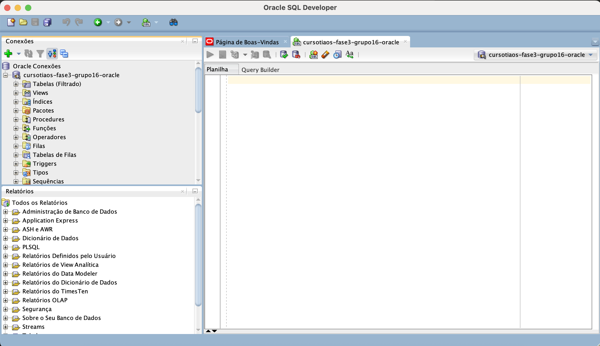

### Etapa 2: Processo de Importação
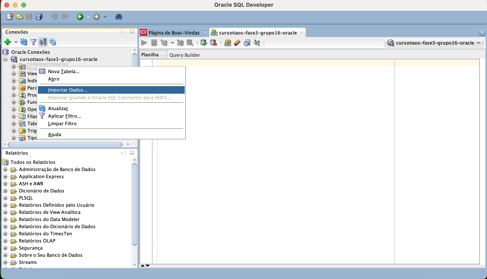

### Etapa 3: Configuração da Importação (1/5)
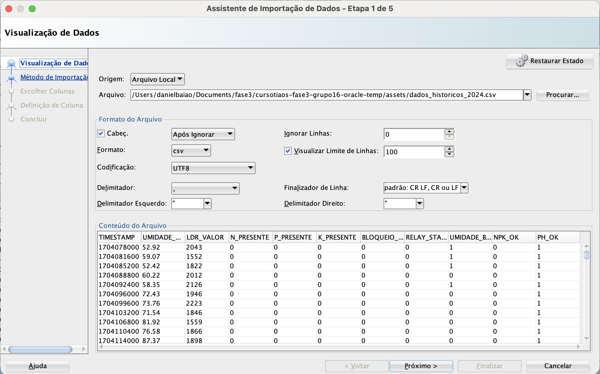

### Etapa 4: Definição da Tabela (2/5)

### Etapa 5: Mapeamento de Colunas (3/5)
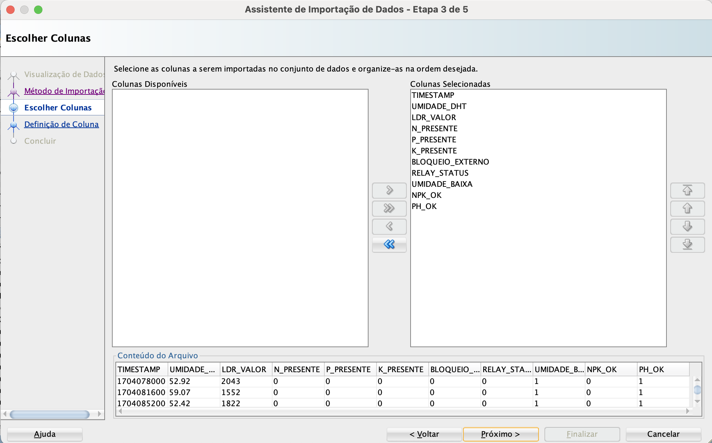

#### TIMESTAMP
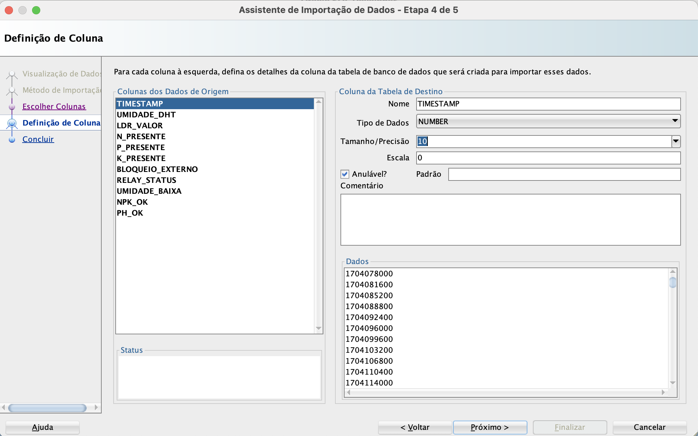

#### UMIDADE_DHT  
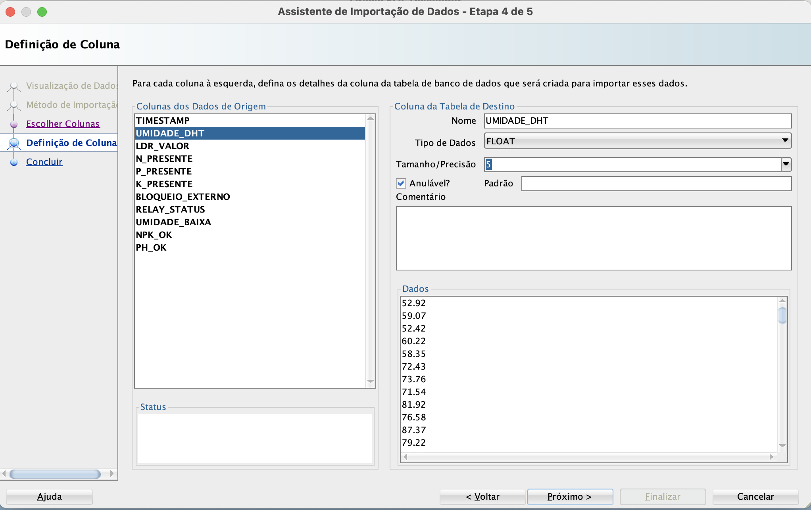

#### LDR_VALOR
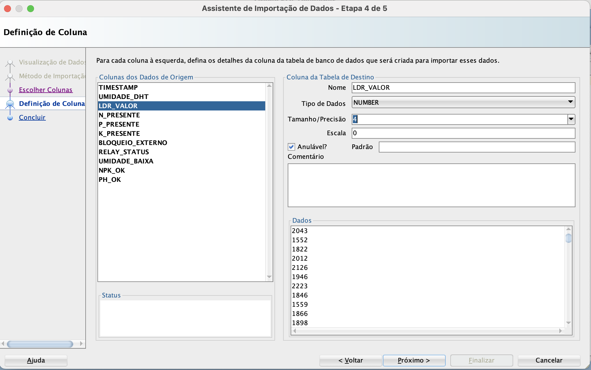

#### Nutrientes N, P, K
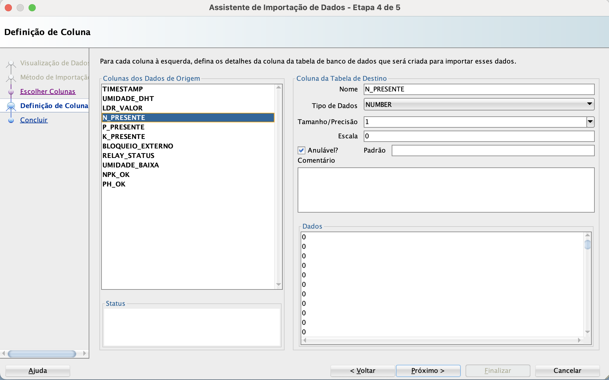

#### Status e Indicadores
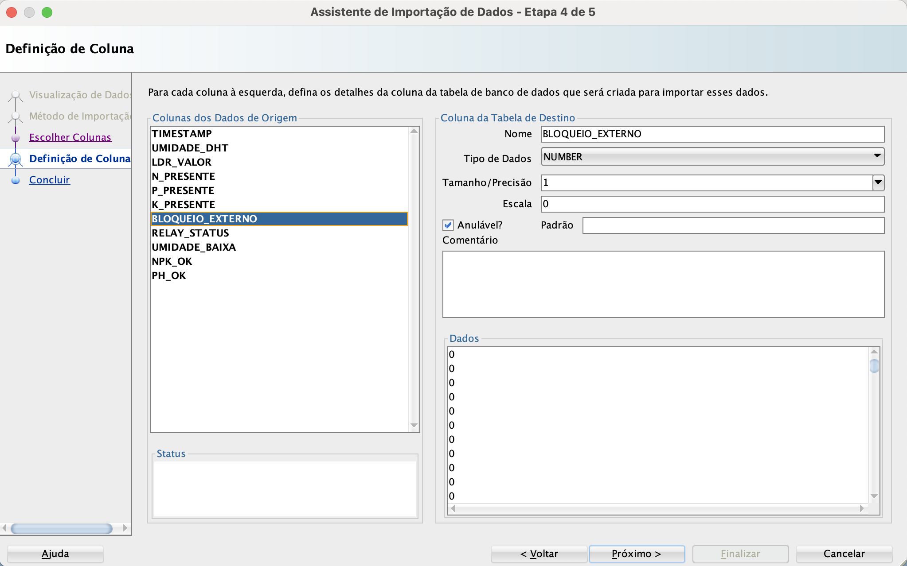
- BLOQUEIO_EXTERNO: NUMBER(1,0)
- RELAY_STATUS: NUMBER(1,0)  
- UMIDADE_BAIXA: NUMBER(1,0)
- NPK_OK: NUMBER(1,0)
- PH_OK: NUMBER(1,0)

### Etapa 6: Revisão Final
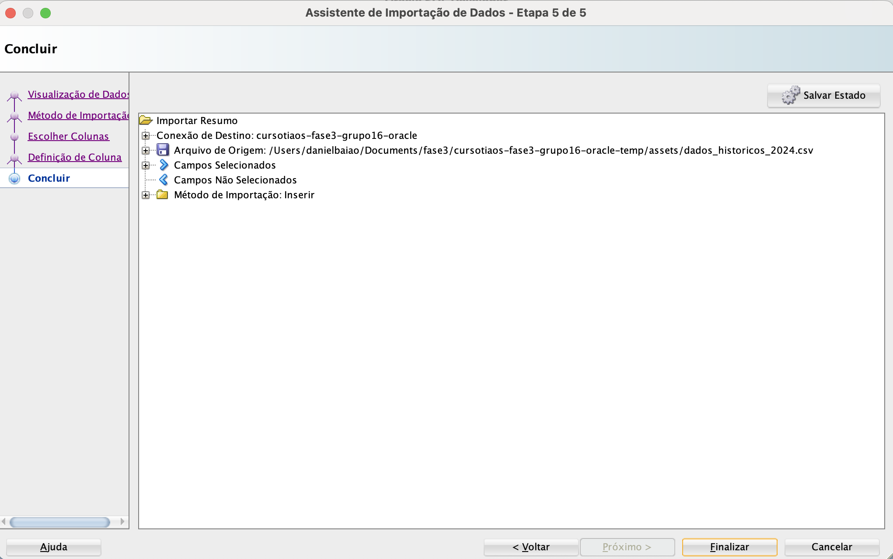

### Etapa 7: Importação Concluída
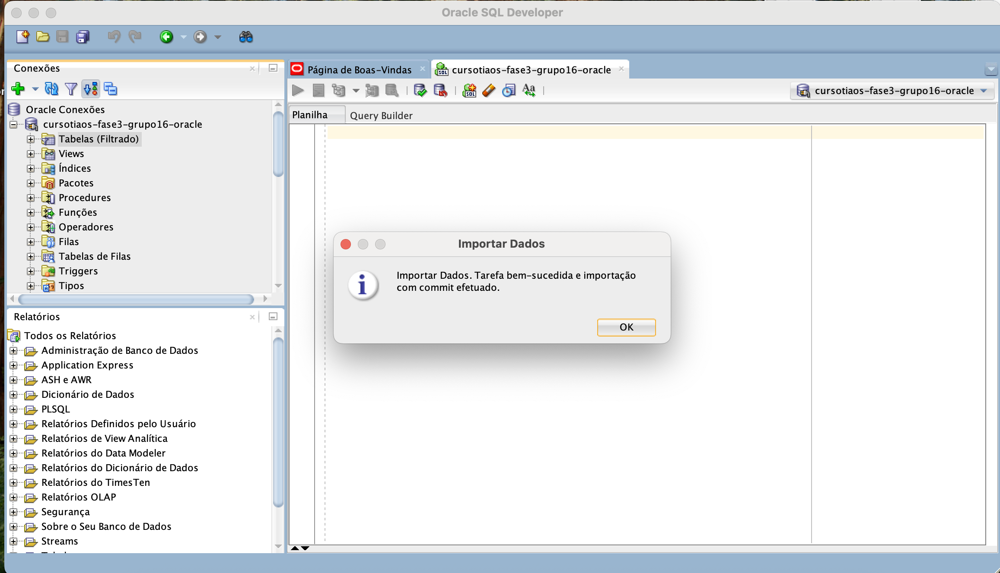

## ✅ Verificação dos Dados

### Visualizar Estrutura da Tabela
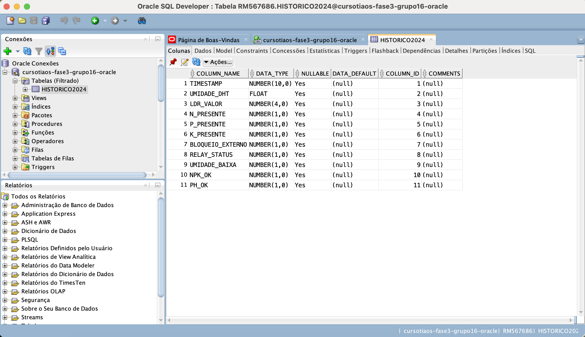

### Consulta Completa dos Dados
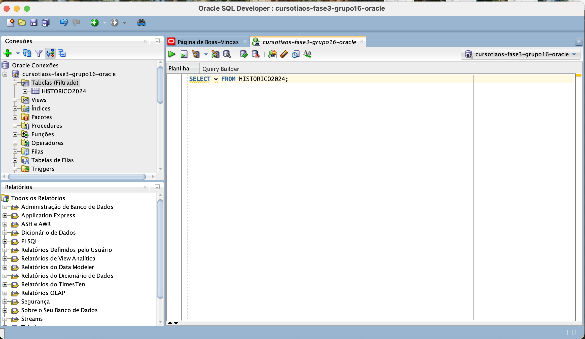

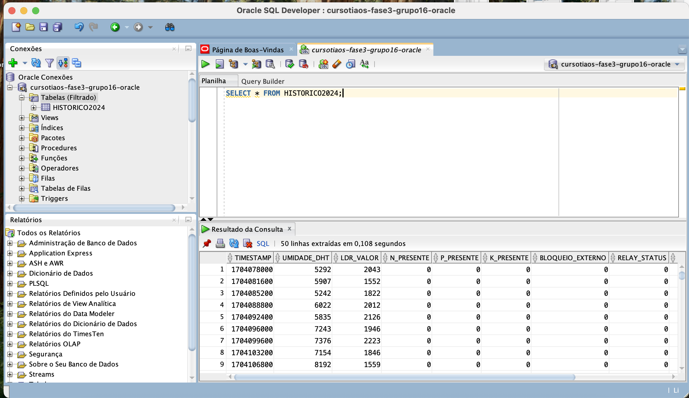

## 🚨 Troubleshooting

### Problemas Comuns

1. **Erro de Conexão**
   - Verifique credenciais FIAP
   - Confirme conectividade de rede
   - Teste novamente a conexão

2. **Erro na Importação**
   - Verifique formato do arquivo CSV
   - Confirme delimitadores
   - Revise tipos de dados das colunas

3. **Tabela não Criada**
   - Verifique permissões do usuário
   - Confirme nome da tabela (sem caracteres especiais)
   - Tente recriar com nome diferente

### Dicas Importantes

- ⚠️ Nome da tabela: máximo 30 caracteres, sem espaços
- ⚠️ Sempre teste a conexão antes de importar
- ⚠️ Faça backup dos dados antes de modificações
- ⚠️ Verifique tipos de dados adequados para cada coluna

## 📊 Próximos Passos

Após importação bem-sucedida:
1. Execute consultas de análise (ver `consultas_analise.sql`)
2. Explore os dados com diferentes filtros
3. Desenvolva dashboard para visualização
4. Documente insights encontrados