# Scripts - Sistema de Irrigação Inteligente

## 📁 Conteúdo

### 📋 Documentação Oracle
- **`oracle_import.md`**:
  - Passo a passo da instalação e configuração
  - Processo detalhado de importação dos dados
  - Screenshots do processo (referenciados em ../assets/)
  - Troubleshooting e dicas importantes

### 🔍 Scripts SQL
- **`consultas_analise.sql`**: 12 consultas especializadas para análise dos dados
  - **Verificação dos Dados**: Visualização e contagem de registros
  - **Análises de Umidade**: Detecção de umidade baixa e estatísticas
  - **Sistema de Irrigação**: Ativações do relay e correlações
  - **Nutrientes NPK**: Status e distribuição dos nutrientes
  - **Sensores**: Análise de luminosidade (LDR) e outros componentes
  - **Relatórios**: Status geral e eficiência do sistema

## 🚀 Como Usar

### 1. Configuração do Oracle
```bash
# Siga o guia completo
cat oracle_setup.md
```

### 2. Executar Consultas SQL
```sql
-- No Oracle SQL Developer, execute as consultas do arquivo:
@consultas_analise.sql
```

### 3. Análises Disponíveis
- **Consulta 1-3**: Verificações básicas e visualização dos dados
- **Consulta 4-6**: Análises de umidade baixa e ativação da irrigação
- **Consulta 7-9**: Estatísticas de sensores (umidade, LDR, relay)
- **Consulta 10-12**: Correlações, status geral e relatório de eficiência

### Consulta 1: Visualizar todos os dados
Comando básico para verificar se a importação foi bem-sucedida
```sql
SELECT * FROM HISTORICO2024;
```
**📷 Resultado da Consulta:**
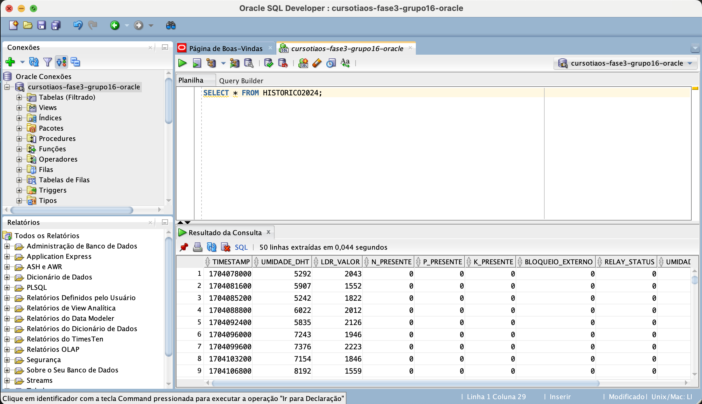

---

### Consulta 2: Contagem total de registros
Verifica quantos registros foram importados
```sql
SELECT COUNT(*) AS TOTAL_REGISTROS 
FROM HISTORICO2024;
```
**📷 Resultado da Consulta:**
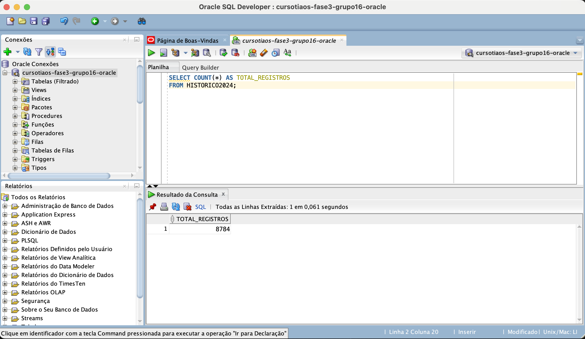

---

### Consulta 3: Registros mais recentes
Mostra os 10 registros mais recentes baseados no timestamp
```sql
SELECT * FROM HISTORICO2024 
ORDER BY TIMESTAMP DESC 
FETCH FIRST 10 ROWS ONLY;
```
**📷 Resultado da Consulta:**


---

### Consulta 4: Análise de umidade baixa
Identifica quando o sistema detectou umidade baixa
```sql
SELECT 
    TO_CHAR(TO_DATE('1970-01-01', 'YYYY-MM-DD') + TIMESTAMP/86400, 'DD/MM/YYYY HH24:MI') AS DATA_HORA,
    UMIDADE_DHT,
    UMIDADE_BAIXA,
    RELAY_STATUS
FROM HISTORICO2024 
WHERE UMIDADE_BAIXA = 1
ORDER BY TIMESTAMP DESC;
```
**📷 Resultado da Consulta:**
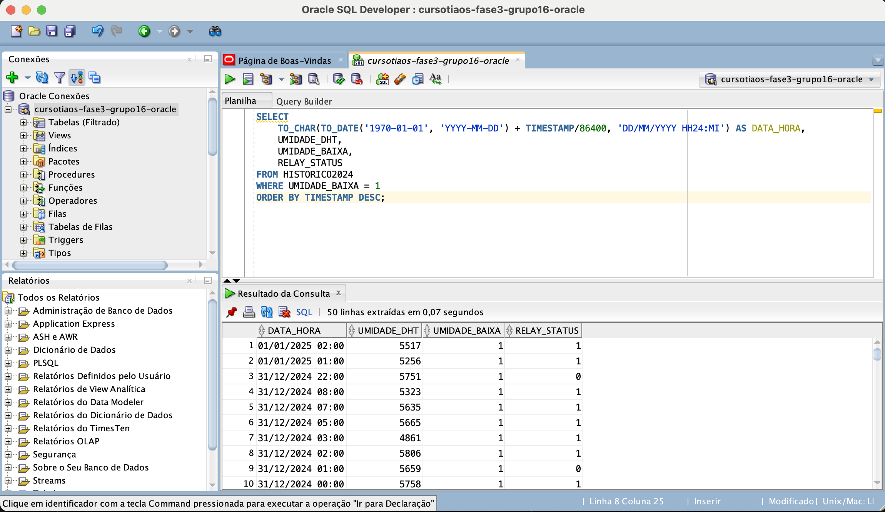

---

### Consulta 5: Quando a irrigação foi ativada
Mostra todos os momentos em que o relay foi ativado
```sql
SELECT 
    TO_CHAR(TO_DATE('1970-01-01', 'YYYY-MM-DD') + TIMESTAMP/86400, 'DD/MM/YYYY HH24:MI') AS DATA_HORA,
    UMIDADE_DHT,
    RELAY_STATUS,
    UMIDADE_BAIXA,
    NPK_OK,
    PH_OK
FROM HISTORICO2024 
WHERE RELAY_STATUS = 1
ORDER BY TIMESTAMP;
```
**📷 Resultado da Consulta:**
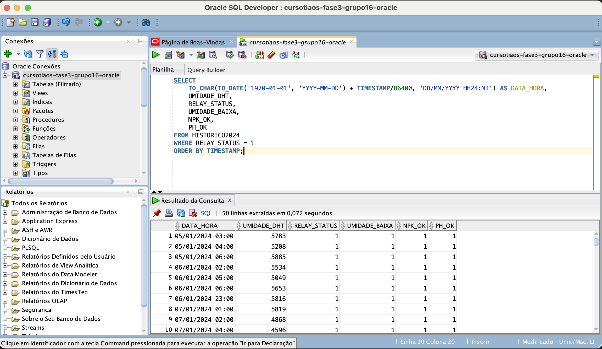

---

### Consulta 6: Status dos nutrientes NPK
Analisa a presença dos nutrientes N, P, K
```sql
SELECT 
    N_PRESENTE,
    P_PRESENTE, 
    K_PRESENTE,
    COUNT(*) AS FREQUENCIA,
    ROUND(COUNT(*) * 100.0 / (SELECT COUNT(*) FROM HISTORICO2024), 2) AS PERCENTUAL
FROM HISTORICO2024 
GROUP BY N_PRESENTE, P_PRESENTE, K_PRESENTE
ORDER BY FREQUENCIA DESC;
```
**📷 Resultado da Consulta:**
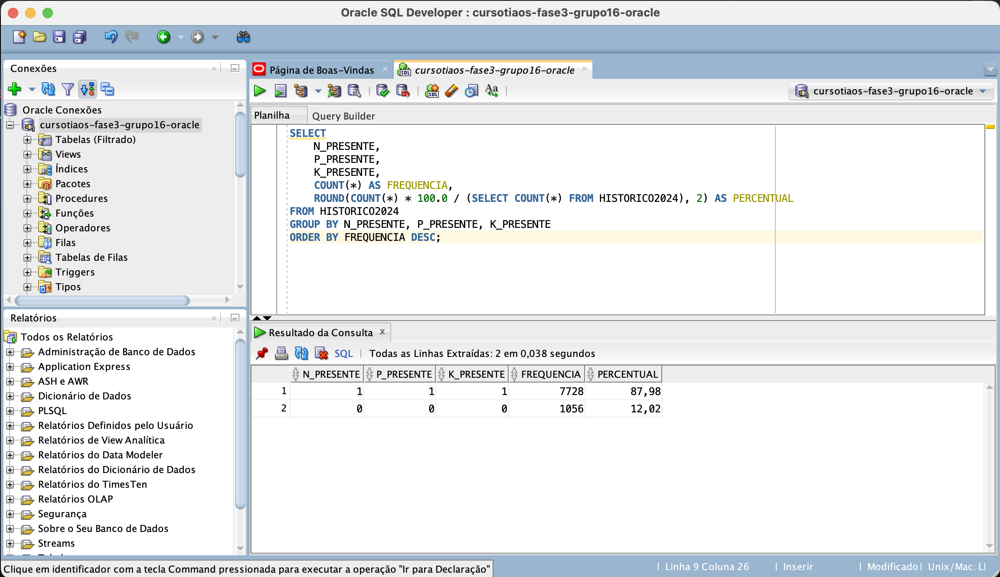

---

### Consulta 7: Estatísticas de umidade
Calcula média, mínimo e máximo da umidade DHT
```sql
SELECT 
    ROUND(AVG(UMIDADE_DHT), 2) AS MEDIA_UMIDADE,
    ROUND(MIN(UMIDADE_DHT), 2) AS MIN_UMIDADE,
    ROUND(MAX(UMIDADE_DHT), 2) AS MAX_UMIDADE,
    ROUND(STDDEV(UMIDADE_DHT), 2) AS DESVIO_PADRAO
FROM HISTORICO2024;
```
**📷 Resultado da Consulta:**
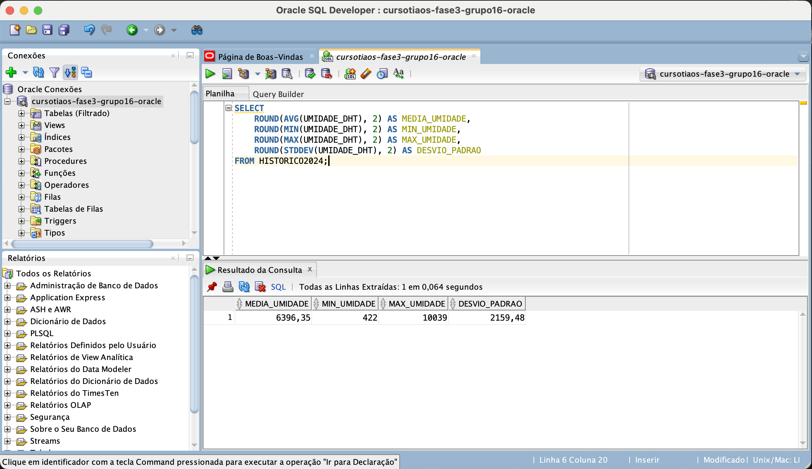

---

### Consulta 8: Análise do sensor LDR (Luminosidade)
Estatísticas do sensor de luz
```sql
SELECT 
    ROUND(AVG(LDR_VALOR), 2) AS MEDIA_LDR,
    MIN(LDR_VALOR) AS MIN_LDR,
    MAX(LDR_VALOR) AS MAX_LDR,
    ROUND(STDDEV(LDR_VALOR), 2) AS DESVIO_PADRAO_LDR
FROM HISTORICO2024;
```
**📷 Resultado da Consulta:**
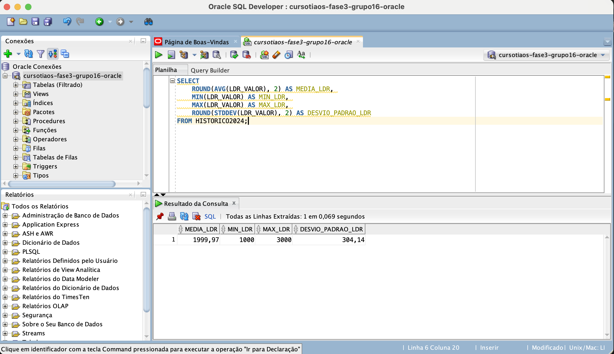

---

### Consulta 9: Contagem de ativações do relay
Quantas vezes o sistema de irrigação foi ativado
```sql
SELECT 
    RELAY_STATUS,
    COUNT(*) AS TOTAL_REGISTROS,
    ROUND(COUNT(*) * 100.0 / (SELECT COUNT(*) FROM HISTORICO2024), 2) AS PERCENTUAL
FROM HISTORICO2024 
GROUP BY RELAY_STATUS;
```
**📷 Resultado da Consulta:**
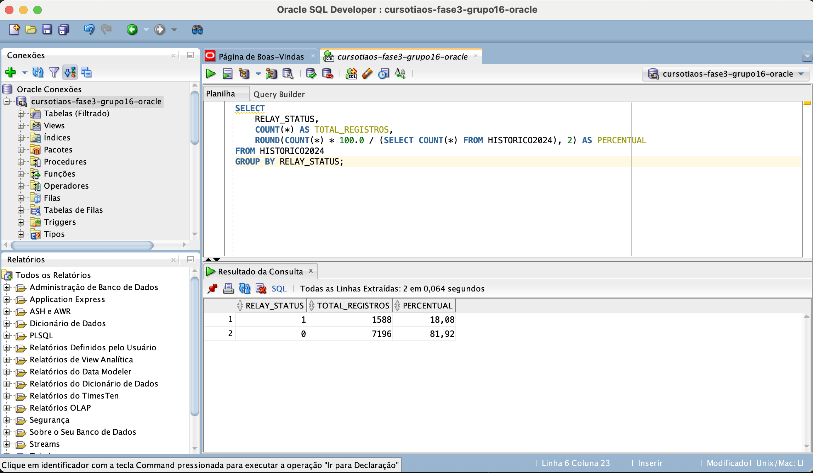

---

### Consulta 10: Correlação entre umidade e ativação do relay
Verifica a relação entre umidade baixa e ativação da irrigação
```sql
SELECT 
    UMIDADE_BAIXA,
    RELAY_STATUS,
    COUNT(*) AS OCORRENCIAS
FROM HISTORICO2024 
GROUP BY UMIDADE_BAIXA, RELAY_STATUS
ORDER BY UMIDADE_BAIXA, RELAY_STATUS;
```
**📷 Resultado da Consulta:**
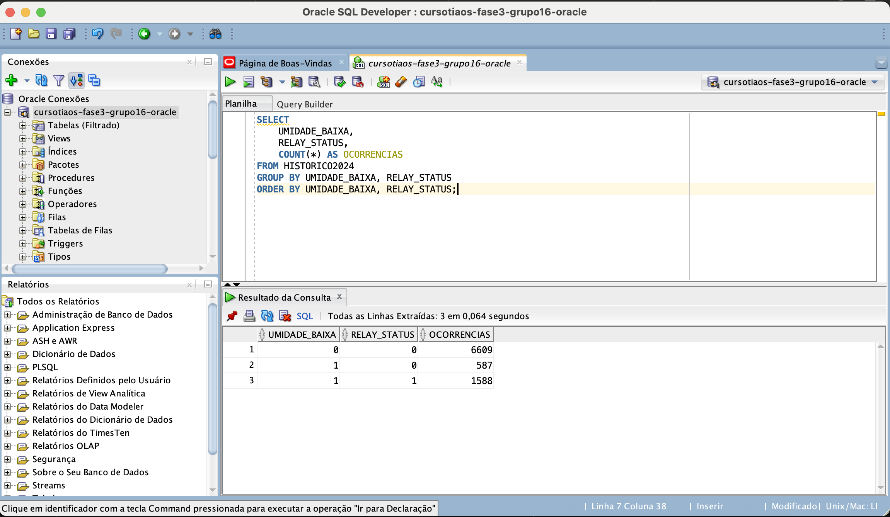

---

### Consulta 11: Status geral dos sistemas
Visão geral do funcionamento de todos os componentes
```sql
SELECT 
    'Status NPK OK' AS COMPONENTE,
    SUM(CASE WHEN NPK_OK = 1 THEN 1 ELSE 0 END) AS FUNCIONANDO,
    SUM(CASE WHEN NPK_OK = 0 THEN 1 ELSE 0 END) AS COM_PROBLEMA,
    ROUND(SUM(CASE WHEN NPK_OK = 1 THEN 1 ELSE 0 END) * 100.0 / COUNT(*), 2) AS PERCENTUAL_OK
FROM HISTORICO2024
UNION ALL
SELECT 
    'Status PH OK' AS COMPONENTE,
    SUM(CASE WHEN PH_OK = 1 THEN 1 ELSE 0 END) AS FUNCIONANDO,
    SUM(CASE WHEN PH_OK = 0 THEN 1 ELSE 0 END) AS COM_PROBLEMA,
    ROUND(SUM(CASE WHEN PH_OK = 1 THEN 1 ELSE 0 END) * 100.0 / COUNT(*), 2) AS PERCENTUAL_OK
FROM HISTORICO2024
UNION ALL
SELECT 
    'Bloqueio Externo' AS COMPONENTE,
    SUM(CASE WHEN BLOQUEIO_EXTERNO = 0 THEN 1 ELSE 0 END) AS FUNCIONANDO,
    SUM(CASE WHEN BLOQUEIO_EXTERNO = 1 THEN 1 ELSE 0 END) AS COM_PROBLEMA,
    ROUND(SUM(CASE WHEN BLOQUEIO_EXTERNO = 0 THEN 1 ELSE 0 END) * 100.0 / COUNT(*), 2) AS PERCENTUAL_OK
FROM HISTORICO2024;
```
**📷 Resultado da Consulta:**
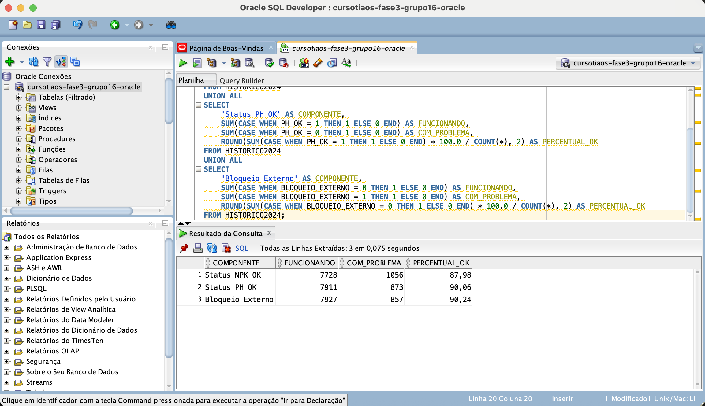

---

### Consulta 12: Relatório de eficiência do sistema
Análise da eficiência do sistema de irrigação
```sql
SELECT 
    'Resumo Executivo do Sistema de Irrigação' AS RELATORIO,
    (SELECT COUNT(*) FROM HISTORICO2024) AS TOTAL_MEDICOES,
    (SELECT COUNT(*) FROM HISTORICO2024 WHERE RELAY_STATUS = 1) AS TOTAL_ATIVACOES,
    ROUND((SELECT COUNT(*) FROM HISTORICO2024 WHERE RELAY_STATUS = 1) * 100.0 / 
          (SELECT COUNT(*) FROM HISTORICO2024), 2) AS PERCENTUAL_ATIVACAO,
    (SELECT ROUND(AVG(UMIDADE_DHT), 2) FROM HISTORICO2024) AS UMIDADE_MEDIA_GERAL,
    (SELECT COUNT(*) FROM HISTORICO2024 WHERE UMIDADE_BAIXA = 1) AS ALERTAS_UMIDADE_BAIXA
FROM DUAL;
```
**📷 Resultado da Consulta:**
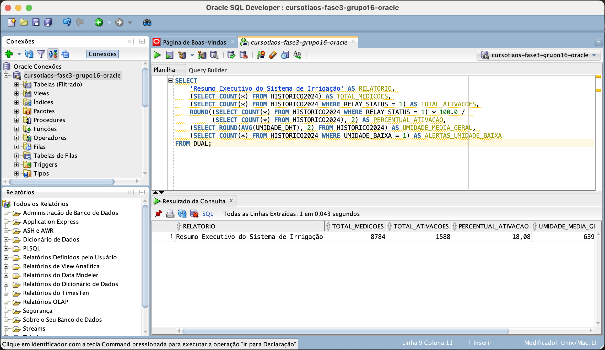

## 🎯 Configurações dos Thresholds

### Valores de Umidade
- **Formato**: Valores inteiros (0-10000)
- **Conversão**: Dividir por 100 para obter percentual (Ex: 6500 = 65%)
- **Threshold Baixa**: < 4000 (40%)
- **Threshold Adequada**: 4000-8000 (40-80%)

### Valores de NPK
- **P (Fósforo)**: Valores 0-255, threshold crítico < 50
- **K (Potássio)**: Valores 0-255, threshold crítico < 50
- **pH**: Valores 0-14, faixa ideal 6.0-7.5

### Status do Relay
- **0**: Irrigação desligada
- **1**: Irrigação ligada
- **Critério**: Ativado quando UMIDADE_BAIXA = 1

### Arquivo de Saída
- **Formato**: `consultas_resultados_YYYYMMDD_HHMMSS.sql`
- **Localização**: Scripts executados no Oracle SQL Developer
- **Conteúdo**: Resultados das 14 consultas com comentários explicativos

## 🔗 Links Relacionados
- Configuração Oracle: `oracle_setup.md`
- Dados: `../assets/dados_historicos_2024.csv`
- Dashboard: `../src/dashboard.py`
- Documentação: `../document/`